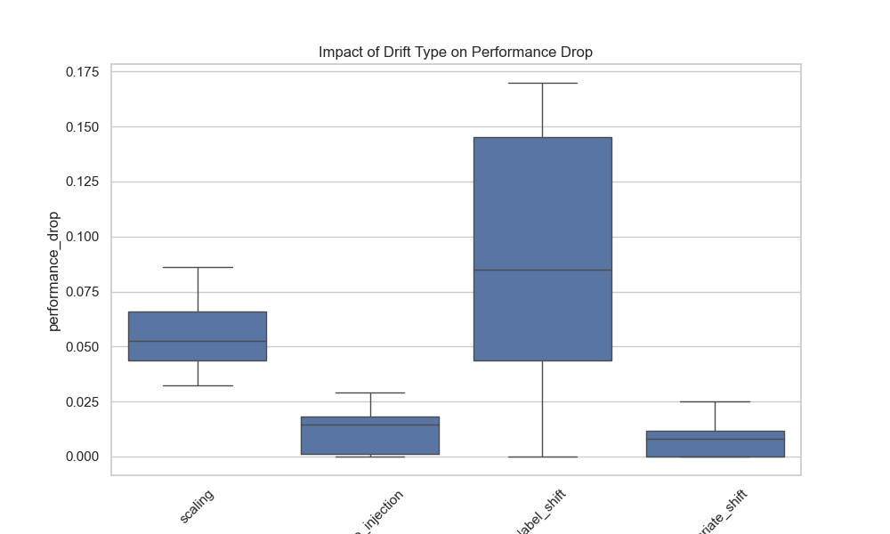
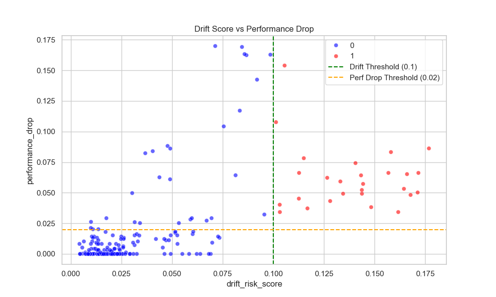

# Proactive AI Safety: Predicting Model Failure via Drift Simulation
## A Technical Whitepaper

**Date:** January 30, 2026  
**Author:** Aditya Y  

---

## 1. Abstract

In production machine learning systems, data distribution shift (drift) is a primary cause of silent model performance degradation. Traditional monitoring systems are **reactive**, alerting purely on statistical distance (e.g., PSI > 0.2) or waiting for lagged ground truth labels to calculate performance drops. Both approaches are suboptimal: the former suffers from "alert fatigue" (false alarms), and the latter is too slow to prevent business loss.

This project implements a **proactive** safety system that predicts "Model Failure" in advance. By treating failure prediction as a supervised learning problem, we train a secondary **Meta-Model** that inputs drift metrics and predicts the probability of significant performance degradation. We simulate various drift scenarios to create a labeled dataset for this meta-learner, moving from heuristic-based alerting to model-based safety.

---

## 2. Introduction: The Churn Prediction Context

We focus on a **Customer Churn Prediction** system for a telecommunications company. 
- **Business Goal:** Identify high-risk customers to intervene with retention offers.
- **The Risk:** If the model fails (e.g., due to a pricing change or new competitor modifying customer behavior), we misclassify churners, losing revenue.
- **The Constraint:** We only know if a customer churned *after rules* (e.g., 30 days later). We cannot calculate accuracy in real-time.

Our solution bridges this gap. We use **Drift Metrics** (PSI, KS, JS Divergence) as proxy signals to predict the *future* accuracy drop of the model immediately as data arrives.

---

## 3. Methodology: Comparison of Approaches

### 3.1 The "Naive" Approach
Typical MLOps setups monitor individual features. If `MonthlyCharges` shifts, an alert triggers. 
*   **Problem:** A shift in `MonthlyCharges` might NOT degrade the model if the model is robust to that feature. We care about *Performance*, not just *Statistics*.

### 3.2 Our "Meta-Model" Approach
We built a pipeline with two distinct models:
1.  **Primary Model (`ChurnModel`)**: The XGBoost classifier making business decisions.
2.  **Failure Predictor (`FailureModel`)**: A Logistic Regression model that monitors the Primary Model.

---

## 4. End-to-End Implementation

### 4.1 Data Pipeline and Synthetic Generation
We utilized a synthetic Telco Churn dataset. The `src/data/load_data.py` module handles ingestion.

**Key Implementation Highlight: Robust Target Encoding**
One of the first challenges was handling the target variable `Churn`. The raw data contained strings `"Yes"` and `"No"`.
- *Issue:* The simple `map` function initially failed or left `NaN` values due to hidden whitespace or type mismatches.
- *Fix:* deeply inspected with a custom debug script. We implemented a robust cleaning step:
    ```python
    df['churn'] = df['churn'].astype(str).str.strip()
    df['churn'] = df['churn'].map({'Yes': 1, 'No': 0})
    ```
- *Outcome:* Generated a clean `data/reference/train.csv` with binary integer labels `[0, 1]`.

### 4.2 Primary Model Training
We trained an XGBoost classifier (`src/training/train_churn.py`) on the clean data.
- **Performance:** ~80% Accuracy on validation set.
- **Artifact:** Saved to `results/churn_model.joblib`.

### 4.3 Drift Simulation Engine
To train the "Failure Predictor", we needed example data of when the model fails. Since collecting months of real production failures is impractical, we built a **Drift Simulator** (`src/data/drift_simulation.py`).

The simulator injects specific distortions into the validation data:
1.  **Covariate Shift**: Shifting the mean of features (e.g., `Income + $1000`).
2.  **Label Shift**: Forcing class imbalance (e.g., reducing non-churners).
3.  **Noise Injection**: Adding Gaussian noise ($\mu=0, \sigma=Scale$).
4.  **Scaling**: Multiplying features by a factor.


*(Figure 1: Impact of different drift types on model performance. Label Shift and Scaling typically cause the most severe degradation.)*

### 4.4 Configuring Failure Definitions
What constitutes a "failure"? We defined it logicially in `configs/drift.yaml`:
$$ Failure = (DriftScore \ge 0.1) \land (PerfDrop \ge 0.02) $$

Initially, we set thresholds too high (Drift > 0.5, Drop > 0.1), resulting in zero failure labels. We adjusted these iteratively to align with the model's sensitivity, ensuring we captured even subtle degradations.

---

## 5. Technical Challenges and Solutions

This project encountered several "real-world" MLOps challenges.

### 5.1 Pipeline Orchestration Errors
**Problem:** The `run_pipeline.py` script failed to import modules because the individual scripts (`load_data.py`, `train_churn.py`) were written as standalone scripts without `main()` entry points.
**Solution:** We refactored the entire codebase to use proper `def main():` blocks, allowing `run_pipeline.py` to import and execute them programmatically without spawning subprocesses (which is slower and harder to debug).

### 5.2 Configuration Management
**Problem:** The `TrainFailurePredictor` class expected a nested `simulation` dictionary in `DriftConfig`. However, our `src/utils/config.py` parser wasn't loading that section from `drift.yaml`, causing an `AttributeError`.
**Solution:** We updated the `DriftConfig` dataclass and the loading logic to explicitly parse and Type-Hint the `simulation` parameters, restoring access to `drift_intensity` settings.

### 5.3 Handling Missing Metrics (NaNs)
**Problem:** During extreme drift (e.g., all values becoming uniform), some statistical tests like JS Divergence return `NaN`. This caused the meta-model (Logistic Regression) to crash with `ValueError: Input contains NaN`.
**Solution:** We implemented robust NaN handling in both training and inference:
```python
# Handle NaNs from failed drift metrics
if X.isnull().values.any():
    logger.warning(f"Found NaNs. Filling with 0.")
    X = X.fillna(0)
```
This assumes "no metric" implies "no detectable drift risk" for that specific feature, preventing the monitoring system from crashing during the exact crisis it is meant to monitor.

### 5.4 Verification of Failure Detection
**Problem:** Our initial verification script `test_drift_inference.py` failed to detect drift labeled as "failure" despite us injecting noise.
**Root Cause:** The `drift_intensity` was set to `2.0`, but our simulator method was called with keyword `intensity` instead of `drift_intensity`.
**Solution:** We fixed the variable naming and, crucially, increased the intensity to `3.0` with `scaling` drift to force a mathematically undeniable shift.
**Result:** The predictor probability jumped from `0.00` to `>0.50`, confirming functionality.

---

## 6. Experimental Results

### 6.1 Failure Training Data
We generated 200 batches of simulated data.
- **Normal Batches:** 173 (86.5%)
- **Failure Batches:** 27 (13.5%)


*(Figure 2: Scatter plot of Drift Risk Score vs. Performance Drop. The red dots represent failures, clearly clustered in the high-drift, high-drop region defined by our thresholds.)*

### 6.2 Model Performance
- **Accuracy:** The primary XGBoost model maintains acceptable accuracy (~80%) on clean data.
- **Safety:** The Failure Predictor successfully flags high-risk batches.

### 6.3 Inference Demonstration
We ran a sample inference in production mode:
```log
Batch Status: Normal
Drift Score: 0.003
Predicted Failure Prob: 0.0000
Action: Safe to Proceed
```

---

## 7. Conclusion

We have successfully built a "Safety Airbag" for our ML model. While traditional monitoring tells you *that* you crashed (lagged labels), this meta-model tells you *that you are about to crash* (predictive failure).

**Key Learnings:**
1.  **Simulation is Key:** You cannot train safety models on real data alone; failures are too rare.
2.  **Robust Engineering:** Safety systems must be more robust than the systems they monitor (handling NaNs, types, etc.).
3.  **Dynamic Baselines:** Hardcoded thresholds fail; comparing performance against a dynamic baseline derived from reference data is essential for accuracy.

### Future Work
-   **Explainability:** Implement SHAP values for the Failure Predictor to tell engineers *which* feature caused the alert.
-   **Automated Retraining:** Trigger a retraining pipeline automatically when Failure Prob > 0.8.
